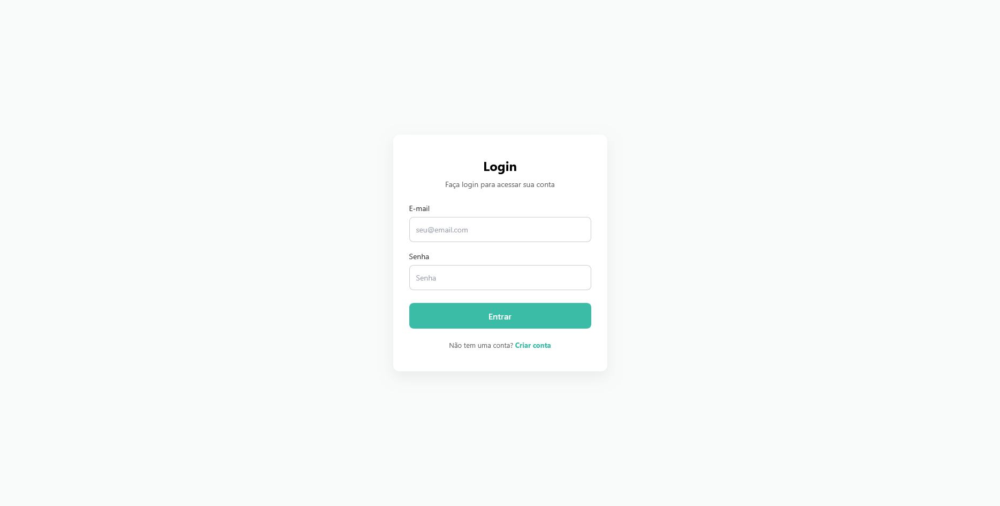
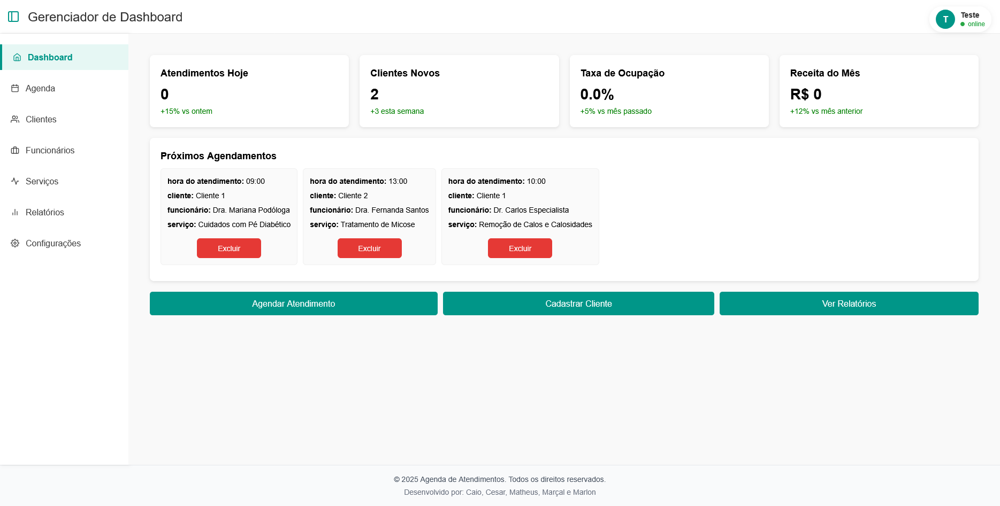
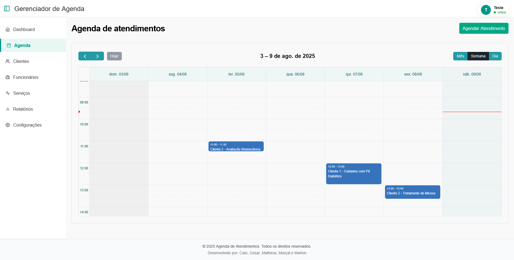
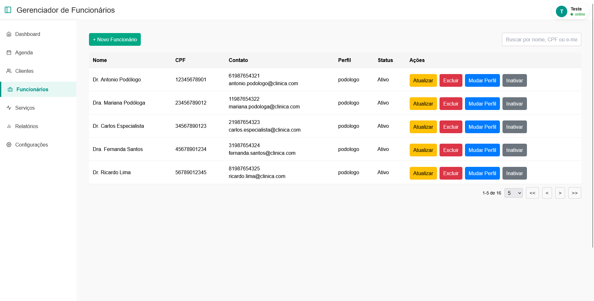
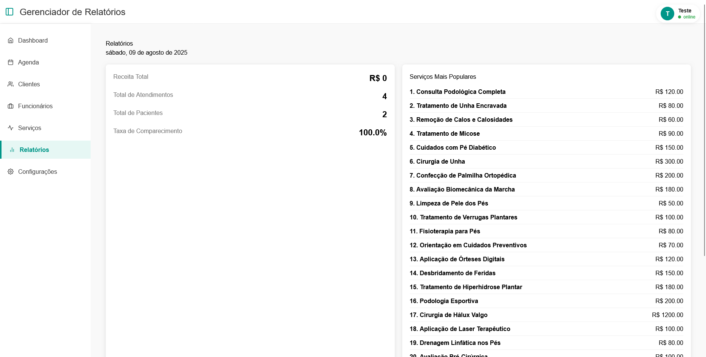

# 📌 Visão Geral

Frontend do sistema de gestão clínica desenvolvido em React, que consome a API do backend em .NET. Possui interfaces para gerenciamento de pacientes, consultas, profissionais e relatórios. 
# � Como Executar o Projeto
Pré-requisitos

   - Node.js (v16 ou superior)
   - npm ou yarn
   - Backend em execução (veja o README do backend)

Configuração

## Clone o repositório:

```bash
git clone https://github.com/CaioVAzeredo/front-end-gestao-clinica.git
cd front-end-gestao-clinica
````

## Instale as dependências:

```bash
npm install
# ou
yarn install
```

## Configure a URL da API:

Crie um arquivo .env na raiz do projeto com:

```text
REACT_APP_PORT=5239
```

## Executando a Aplicação

```bash
npm start
# ou
yarn start
```

O frontend estará disponível em: http://localhost:3000

# 🔗 Integração com Backend

Certifique-se que o backend está em execução antes de usar o frontend. Todas as requisições são feitas para a porta configurada no .env.

Segue o repositório de backend: https://github.com/cesaraugusto0/GestaoClinica

# 📦 Build para Produção

```bash
npm run build
# ou
yarn build
```

Os arquivos de produção serão gerados na pasta build/.

# 🖥️ Telas Principais

## Login


## Dashboard


## Cadastro/Listagem de Clientes


## Agenda


## Gerenciamento de Funcionários


## Relatórios



